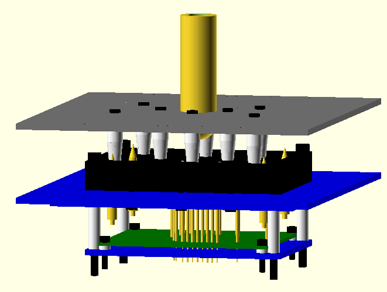
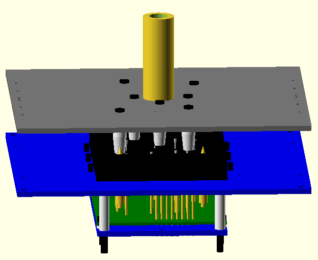
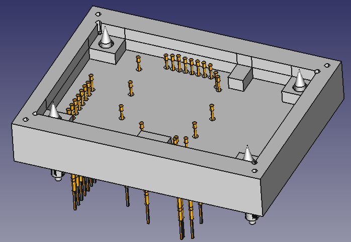
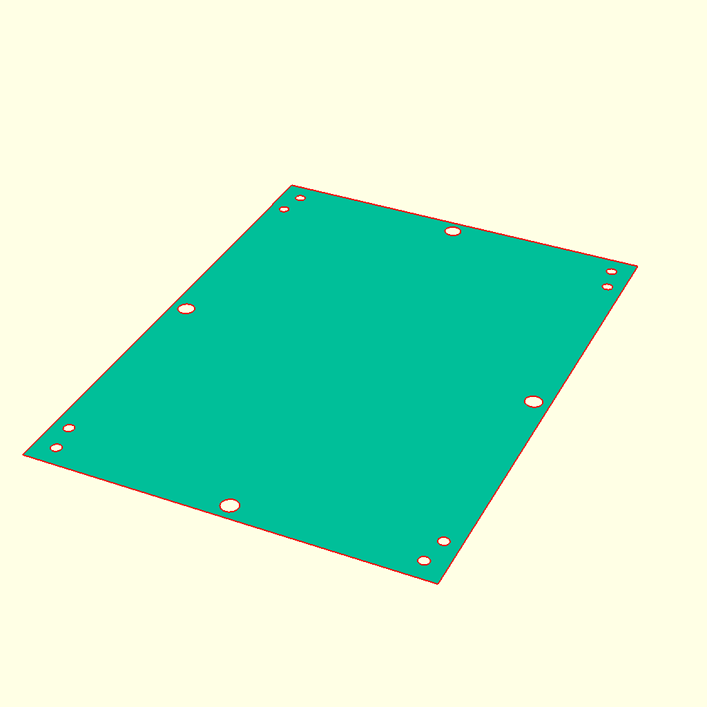
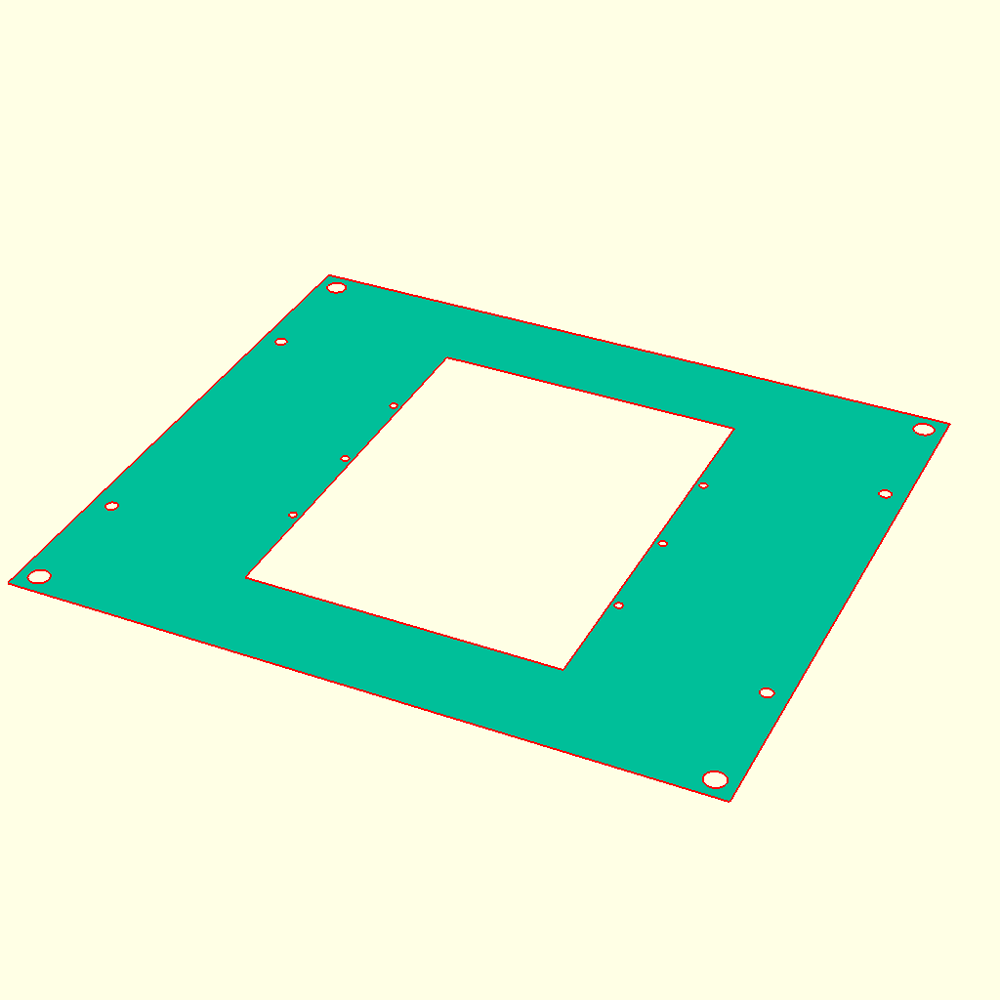
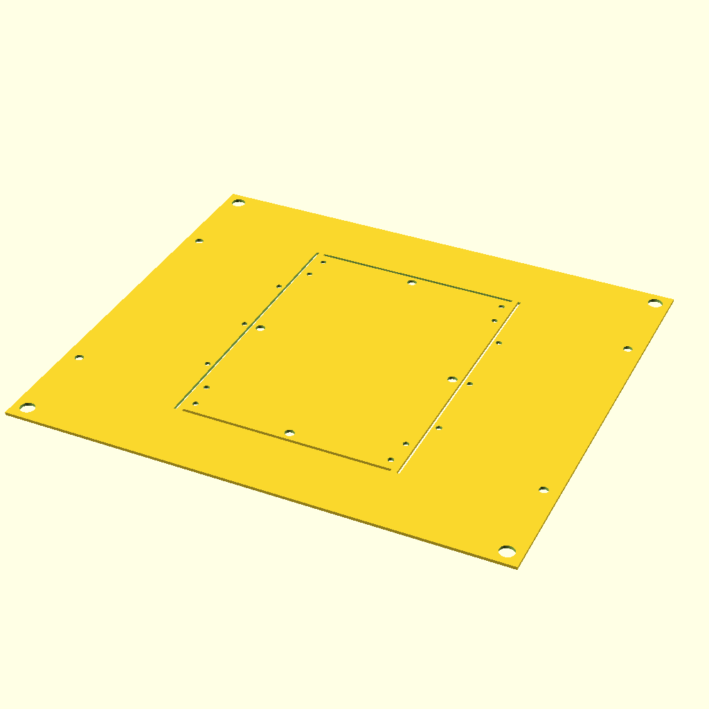
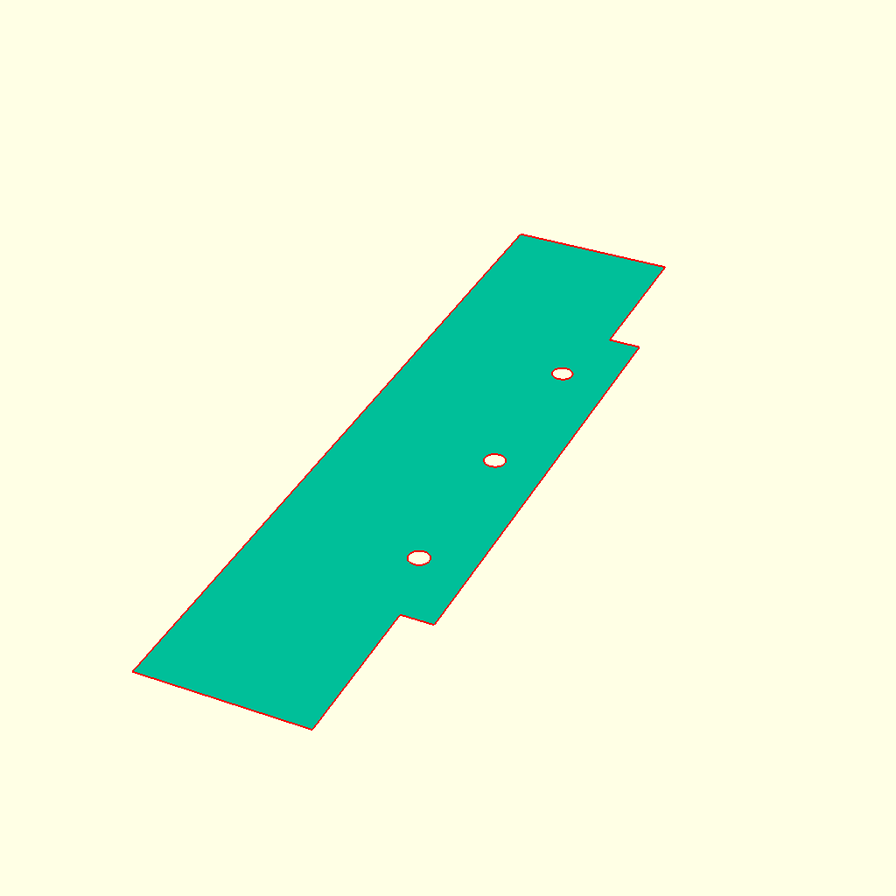
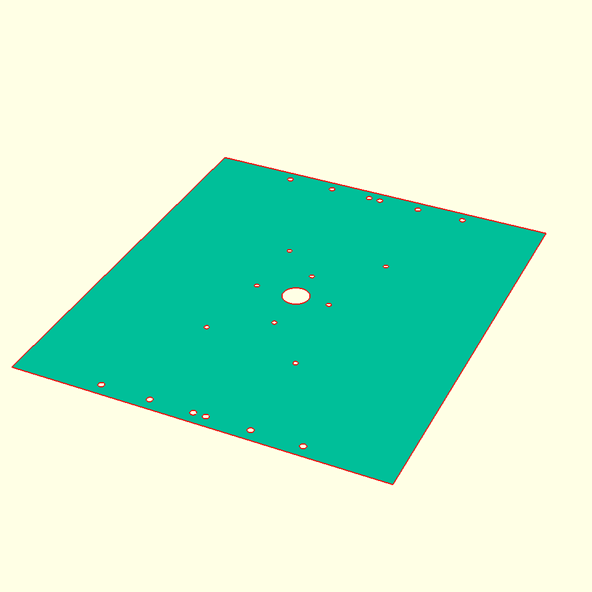
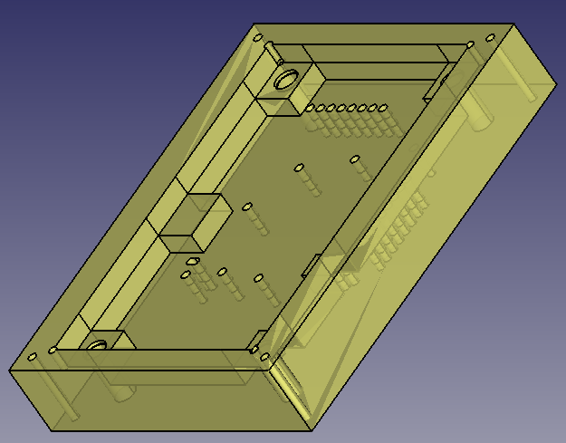

# parametric-test-jig

*Parameterized OpenSCAD projects allowing single command generation of probe stations.*

## Purpose & Philosophy
Probe stations typically have many parts that need to line up exactly with several different parts.
+ PCB under test pads must line up with the probes
+ Probes must lineup with a base PCB or be wired.
+ Pressure pins have to miss components
+ PCB supports must not interfere with parts
+ Alignment pins need to line up with PCB mounting holes
+ The entire stack needs to have the correct vertical spacing with mounting holes that line up.

Typically only high value designs end up with a test jig. They are relatively complicated
and time consuming, requiring investment to make one. Managing several becomes a real support task.
The complexity leads to changing the design to simplify the test jig. The description of the jig is
simple: test probe bed of nails that lines up with the board but the development is long and fiddly.
The purpose of this project is to make a jig from that description. While you wait for boards to be delivered
use this project to have a probe station ready by the time they come in.

Time is burned during bring-up
that could be solved with a jig but it isn't available until much later.
The aim of this project is to make it easy to start each project with a development
jig at your elbow. Ideally designs can be related, allowing jigs to be reused when the designs are derivative.
This project focuses on making updates to a large body of related projects as simple as possible.

+ While designing your board plan the tester. This will help ensure appropriate testing is possible
+ Compile the jig from your design with minimal effort
+ Get both board and jig in at similar times, allowing development and debug to take advantage of the testing infrastructure. As the test has to be designed why not benefit from that work earlier?

## Applications
+ Manufacturing test
+ Programming station
+ Simplify connections to a development board.

## Features
+ Create a test probe or pogo pin adapter to a PCB design with as little trouble as possible
+ Minimize duplicated effort when creating a test design
+ Allow a parameterized model that is easily updated to the master version.
    + Have no modifications to the generated sections, allowing updates without needing hand work
+ Allow resue of mechanical sections and mechanical designs
+ Exactly place parts to ensure they will correctly mate with other mechanical sections and PCBs.
+ Single command generation of manufacturing documentation
+ Libraries of parts available for reuse

## Description
The current version has a single jig structure as the target. A 3D printed (or machined) part holds the probes & alignment pins, supports the PCB, and has integrated mounting holes for connecting the other sections. The pin end of th probes are soldered into a base PCB which is mounted to a base plate which inturn is connected to the cradles mounting screws. This all fits in a standard aliexpress test jig press.

This design centers around the cradle as the main holder of complexity. That can be placed into any number of assemblies with a new assembly.scad design.

A Makefile allows all units to be exported for manufacturing with a single command.

This project works with kicad-testpoints and kicad-parts-placer to pull data from a kicad design and generate a test pcb and the jig.

## Test Jig Press Generated Sections
| Type | Manufacturing Process | Description |
|------|-----------------------|-------------|
| Base plate | Laser cut | Mechanical mount for the testing PCB |
||| |
| Support plate | Laser cut | Mechanical mount on the jig chassis. This supports the cradle.
||| |
| Support plate + Base plate | Laser cut | Mechanical mount on the jig chassis. This supports the cradle.
||| |
| Support bracket | Laser cut | Bracket that screws into the support plate that the cradle sits on. This part is added to allow the cradle to be taken in and out after the pins have been soldered |
||| |
| Pressure plate | Laser cut |Plate with pressure pins mounted which compresses the board. Pin placement is done to ensure the pins evenly compress the board without interfering with parts.
||| |
| Cradle | 3D printed/machined | Support for the design under test, guide for placement over alignment pins, holder of the probes, mechanical support for cassette assembly. |
||| |

## Workflow
### Starting a new project
1. Design the PCB with testing in mind, introducing testing later is expensive. Aim to have probes on only one side of the board. Choose the test point size and spacing to match the probes you intend to use. Prefer a single probe pitch.
2. Generate a list of test points and alignment pins matching the format of the example. 
3. Run the openscad generator on the list to generate the openscad source file of probes and alignment pins.
4. Edit the design.scad file to add supports and to define the board characteristics

+ List of probes
    + Define by hand
    + Use kicad-testpoints + dataframe_to_scad
    + Use a centroid file + dataframe_to_scad
+ Support pins
+ Pressure pins
+ DUT model (as stl or defined in a module)
+ Test PCB model (as stl or defined in a module)
+ setup-shell-environment.sh with path setting to libraries 
+ Customization settings
    + Support outline
    + Board clearance outline
+ Submodule parametric and change the path to objects in the makefile and the path in setup-shell-environment.sh

## Reach Goals & V2.0.0 Features
+ Check parts clearance
    + Check for clearance between objects and features such as the separation between a pogo and a support pillar
+ Auto input of a board outline for the cradle

## References
+ Inspired by ['OpenSCAD ATE generator'](https://github.com/5inf/TestPointReport2STL)
+ <https://www.sculpteo.com/en/tutorial/openscad-prepare-your-model-3d-printing/openscad-user-interface/>
+ <https://mastering-openscad.eu/>
+ <https://github.com/ultimachine/Test-Jig>
+ <https://github.com/fossasia/pslab-test-jig>
+ <https://github.com/wntrblm/Hubble>
+ <https://github.com/brianredbeard/pogo-jig>
+ <https://github.com/Erhannis/PogoPinJigGen>

+ Similar project: <https://github.com/mdeweerd/openfixture>, <https://github.com/tinylabs/openfixture>, <https://tinylabs.io/openfixture/>

